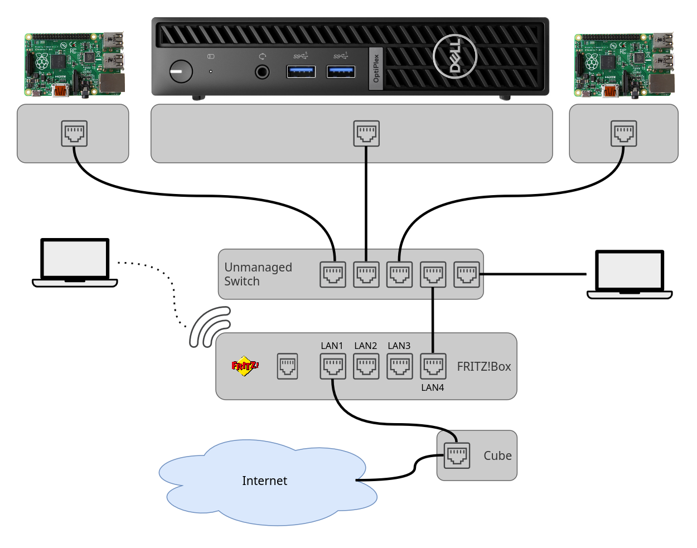
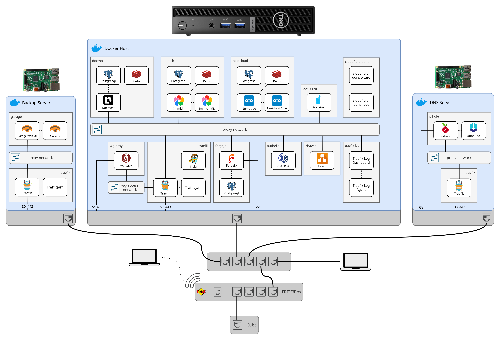

# 2 - Testbench

Let's take a look at the example testbench we will be using: 

For this workshop, we assume a typical home network with a FRITZ!Box and a local, private IP range, `192.168.178.0/24`. The FRITZ!Box serves as the gateway and has the IP address `192.168.178.1`. If you are connected to the home network, you can visit the Web-UI of the FRITZ!Box in your browser, or click [here](http://192.168.178.1). Additionally, the FRITZ!Box receives a public IPv4 address by your ISP, for example, Deutsche Telekom. 

The components in the diagram are:

- The internet, where external requests will originate from
- The cube Ethernet jack, through which we can obtain a public static IP address and Internet access
- The FRITZ!Box, the router that connects the internet to our home network and provides local connectivity and WiFi
- An unmanaged switch to switch wired traffic within the home network
- A Docker Server, which will run most of our self-hosted services
- A Pi-hole DNS server, which we will use for Ad-Blocking and local, private DNS
- A backup server, to store and manage backups from other servers.
- Clients in the home network like phones, tablets, and laptops, which are either connected via a wireless connection or a wired connection

You can also combine, for example, the Backup Server and Pi-hole DNS server for testing. However, in a real deployment, I would not suggest placing all your eggs into one basket and delegating tasks to different machines.

# IP Address Assignments

The assignment of IP addresses for devices in your internal network is up to you. The FRITZ!Box comes with a DHCP server enabled by default. You can either modify the DHCP range and set static IP addresses on your servers directly, or let the FRITZ!Box hand out an IP address via DHCP and pin the IP address to the server in the Web UI. To pin the IP address in the FRITZ!Box Web UI, head to `Heimnetz > Netzwerk`. There you will see a list of all discovered devices. After locating the desired device, click the pencil icon and expand the section `Adressen im Heimnetz (IP-Adressen)`. Check the checkbox `Diesem Netzwerkgerät immer die gleiche IPv4-Adresse zuweisen.` to pin the IP to this device, and hit apply.

Either way, you **must** ensure that your servers have a static IP in the internal network, to prevent the address from changing later, which would result in unreachable services.

# Services Architecture Overview

We will deploy a significant number of services as part of this workshop. We will utilize multiple servers to achieve separation of concerns and a clear distinction of roles between different devices. While the placement of the services on devices is primarily up to you, I suggest the following placement:

If you become confused during this workshop about where to deploy a service, refer back to this graphic, as the instructions will assume you follow the presented placement.

# Initial Setup

To start, equip yourself with hardware. Ideally, you need:

- 1 FRITZ!Box
- 1 Switch
- 1 Mini-PC
- 2 Raspberry Pis with SD-Cards
- Power Cables (ensure correct Voltage and Ampere)
- Ethernet Cables

If there are no Mini-PCs available, two RPis are also fine. You should use a RPi 4B with 8GB RAM for the Docker and backup server, while a RPi 3 will work for the Pi-hole just fine.

The Raspberry Pis and Mini-PCs are already pre-flashed with Ubuntu, and should request an IP address via DHCP when starting up. They also have SSH enabled. The username is set to `user` and the password is `pass`.

The FRITZ!Box is already configured to obtain a public static IP and internet access on LAN1. When plugging in the cables, ensure LAN1 connects to the wall LAN port, while the unmanaged switch connects to any port **except** LAN1. To log in to the FRITZ!Box Web-UI, use the username `admin` if asked, and either the password that is printed on the sticker on the back of the FRITZ!Box, or `opnlab123456`.