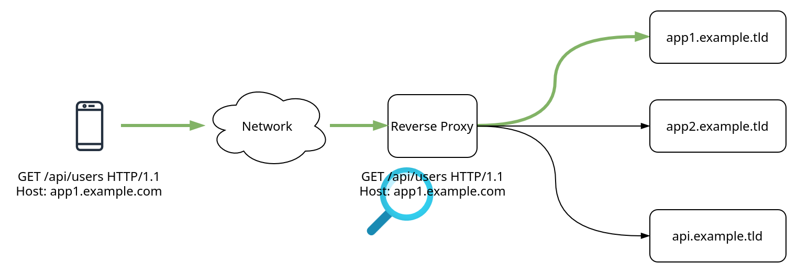
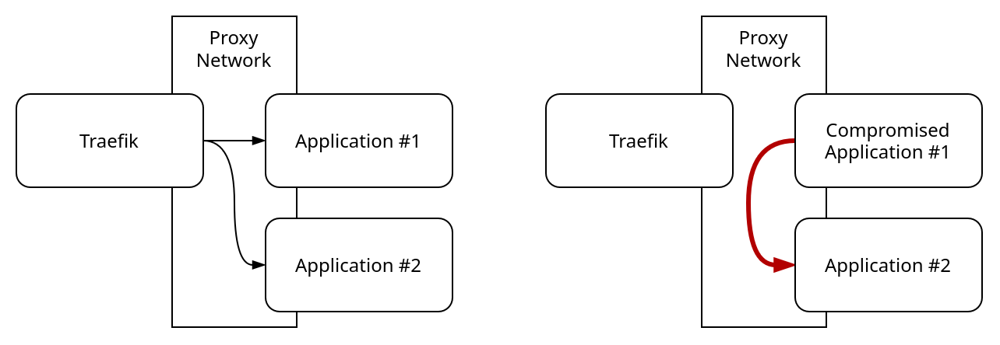

# 6 - Reverse Proxy

A reverse proxy is a program that appears as a web server to clients, but proxies incoming requests to downstream service endpoints, where the actual web server is located:



How requests and where requests are proxied is dynamic and can depend on various things. A common way to classify the traffic is by inspecting the `Host` header. However, other routing policies, such as checking the path (e.g., `/api/users`), are also possible.

There are two ways to organize services behind your reverse proxy and in your domain. You can either use a subdomain, e.g., `service-a.mydomain.tld`, or a subdirectory, e.g., `mydomain.tld/service-a/`. I recommend using a different subdomain for each service, as using a subdomain works for almost any service without requiring any modifications. When using a subdirectory, each service must support it, which often leads to broken URLs and interactions between different services.

Next to routing, reverse proxies can also fulfill other roles, like implementing a cache, SSL termination, and authentication. A reverse proxy does not necessarily have to be reachable from the internet; a locally available reverse proxy is also possible.

# Traefik

For our setup, we will be using the reverse proxy [Traefik](https://traefik.io/traefik). It is well-supported for various architectures, including Docker and Kubernetes.

To get started, create a Docker network called `proxy`:

```bash
sudo docker network create proxy
```

Traefik, as well as all services it proxies, will attach to this network. Next, copy all files from `containers/` to your server.

The compose file for Traefik looks like this:

```yaml
services:
  traefik:
    image: traefik
    container_name: traefik
    restart: unless-stopped
    security_opt:
      - no-new-privileges:true
    networks:
      - proxy
    ports:
      - 80:80
    volumes:
      - /etc/localtime:/etc/localtime:ro
      - /var/run/docker.sock:/var/run/docker.sock:ro
      - ./config/traefik.yml:/traefik.yml:ro
      - ./config/config.yml:/config.yml:ro
      - ./data/logs:/var/log/traefik
    labels:
      - "traefik.enable=true"

      - "traefik.http.routers.Traefik.entrypoints=http"
      - "traefik.http.routers.Traefik.rule=Host(`traefik.vlab.local`)"
      - "traefik.http.routers.Traefik.service=api@internal"
      
networks:
  proxy:
    external: true
```

The main things to note here are:

- The `proxy` network is added to the container such that it is part of the bridge
- Port `80` of the Traefik container is exposed as ingress on the Server
- The Docker socket is mounted in read-only mode
- Configuration files are mounted
- Labels are added to the container
- The proxy network is added as an external network in the compose file

Traefik works by reading the labels of containers via the Docker socket; hence, it requires read access to it. Based on these labels, Traefik automatically updates its configuration by creating routes, configuring middlewares, and so on. What's great about this is that when a Docker Compose stack is created, the routing configuration is automatically updated; furthermore, if the stack is removed, the routes are removed as well, meaning Traefik automatically cleans up after itself.

Let's look at the labels for Traefik:

```yaml
labels:
    - "traefik.enable=true"

    - "traefik.http.routers.Traefik.entrypoints=http"
    - "traefik.http.routers.Traefik.rule=Host(`traefik.vlab.local`)"
    - "traefik.http.routers.Traefik.service=api@internal"
```

First, we enable Traefik on this container. Then, we define a router for the compose service `traefik`, with the entrypoint `http`. We then match all requests for the host `traefik.vlabl.local` and route these requests to the service `api@internal`, which is a special kind of service that is built into Traefik.

The entrypoint `http` is defined in the `traefik.yml` configuration file:

```yaml
entryPoints:
  http:
    address: ":80"
```

Start the Compose stack for Traefik. You should be able to visit `http://traefik.vlab.local`. Note that we created the DNS records for `*.vlab.local` previously in the Pi-hole `config/dnsmasq/03-wildcard-record.conf` file.

# Adding Services

To let Traefik proxy additional services, we must add the corresponding labels to the container in the respective Compose file and ensure that the container is part of the proxy network. Modify the `containers/drawio/docker-compose.yml` file:

```diff
 services:
   drawio:
     image: jgraph/drawio
     container_name: drawio
     restart: unless-stopped
-    ports:
-      - 8080:8080
+    networks:
+      - proxy
+    labels:
+      - "traefik.enable=true"
+
+      - "traefik.http.routers.draw-io.entrypoints=http"
+      - "traefik.http.routers.draw-io.rule=Host(`draw.vlab.local`)"
+      - "traefik.http.routers.draw-io.priority=1000"
+      - "traefik.http.services.drawio.loadbalancer.server.port=8080"
+
+      - "traefik.docker.network=proxy"
+
+networks:
+  proxy:
+    external: true
```

Some changes have to be made:

- The `ports` section is removed, as we don't want to expose the port on the host, but proxy requests to the container through Traefik
- The proxy network is added to the container via `networks` and to the compose file itself
- Traefik labels are added to the container

Looking at the labels, there is one key difference between the labels for Traefik itself:

```yaml
- "traefik.http.services.drawio.loadbalancer.server.port=8080"
```

This label tells Traefik where it 'finds' the proxied service, by specifying that the service is reachable on the container port `8080`. Hence, all requests to the host `draw.vlab.local` will now be proxied to the container `drawio` on port `8080`.

## Proxying External Services

There may be a case where you have an endpoint that is not part of your Docker infrastructure, but rather part of an appliance, such as a server management interface. If you want to proxy requests to this endpoint, you must manually add the service to the `config.yml` file, as Traefik cannot automatically discover it via Docker labels.

There are two key snippets you have to add: a service and a router. The service tells Traefik where to find the endpoint, and the router, which tells Traefik which requests should be matched and proxied to this endpoint:

```yaml
http:
  routers:
    my-external-service: # ensure this is unique when adding others
      entryPoints:
        - "https"
      rule: "Host(`my-external-service.vlab.local`)"
      middlewares:
        - default-headers
      tls: {}
      service: my-external-service # Should match the service name below

  services:
    my-external-service: # Should match the `service: <service name>` above
      loadBalancer:
        servers:
          - url: "http://1.2.3.4:80"
        passHostHeader: true
```

# Trafficjam

To enhance the security of the setup, we also deploy [trafficjam](https://github.com/kaysond/trafficjam). By default, all peers within a Docker network can communicate with each other. To proxy traffic to the services, we use the `proxy` network for Traefik. However, Traefik, as well as all frontend services, are part of the `proxy` network and can therefore communicate with each other. This leaves the possibility open that if any service is compromised, an attacker can traverse to other services, bypassing Traefik and thus SSL and later authentication (right). To mitigate the issue, trafficjam modifies the firewall such that only Traefik is allowed to communicate with other containers in the Docker network (left):

