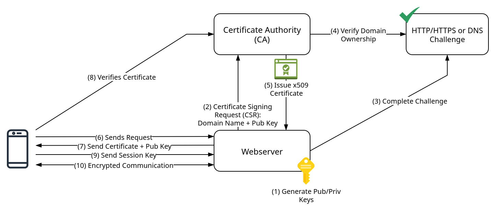

# 6 - Traefik with SSL

In this section, we will add Transport Layer Security (TLS) with valid Secure Sockets Layer (SSL) certificates to our reverse proxy, allowing us to use `https` instead of plain `http`.

Before starting, let's take a look at how TLS works:



1. The server generates a public and private key
2. The server sends a Certificate Signing Request (CSR) with the domain name and public key to the Certificate Authority (CA)
3. The CA requires proof that the server "owns" the domain, and requests to complete a challenge. This can be either a DNS challenge, where the server has to ensure a specific text is stored in a DNS record for the domain, or an HTTP challenge, where a specific text has to be made accessible on a specific path on the server, e.g., `http://example.com/.well-known/...`. The latter requires the server to be publicly accessible, while the DNS challenge can be done for local setups.
4. The CA verifies that the challenge was completed.
5. The CA issues an X.509 Certificate by using its private key. This certificate is now proof that the server owns the public key for the domain.
6. A client sends a request to the server and initiates a TLS handshake.
7. The server sends its public key and the X.509 certificate to the client
8. Because the client trusts the CA, it can now verify the certificate with the CA.
9. The client now trusts the server and generates a session key with the server's public key and sends it.
10. Server and client encrypt data using the session key.

Finally, let's briefly discuss self-signed certificates. Certificates aim to establish trust, as in the phrase "the friend of my friend is also my friend." This requires the client to trust the CA, or the CA higher up in the chain, that, in turn, trusts the CA further down the chain. Technically speaking, the CA root certificate needs to be installed on the client. For a self-signed certificate, the server generates its own certificate. Because the client does not trust the server by default, the browser raises a security warning. While TLS and thus encryption still works, the client can't verify the identity of the server. This means that in theory, the client could communicate with a server that impersonates another server. To circumvent this, the self-signed certificate can be manually installed on the client to establish trust.

Now with a basic understanding, we can see that there are two things required to obtain valid SSL certificates:

- a registered, public domain
- either a publicly accessible server for the HTTP challenge, or a public DNS server to complete the DNS challenge

# Updating Pi-hole Wildcard DNS resolution

We previously used the domain `vlab.local` for Traefik. Now that we use a real domain, we have to update the wildcard DNS record in Pi-hole such that DNS resolution works for the domain: edit the `config/dnsmasq/03-wildcard.conf` configuration of Pi-hole and modify the contents:

```diff
-address=/.vlab.local/<Docker Server IP>
+address=/.$MY_DOMAIN/<Docker Server IP>
```

Restart the Pi-hole compose stack with `sudo docker compose up -d --force-recreate`. Check that the DNS resolution is working:

```bash
dig $MY_DOMAIN
dig wildcard-test.$MY_DOMAIN
```

Both queries should result in the IP of the Docker server where Traefik will be running.

# SSL Certificates with ACME + Traefik

The Automated Certificate Management Environment (ACME) is a protocol designed to automate interactions between certificate authorities and web servers. In our case, Traefik acts as the web-server, and [Let's Encrypt](https://letsencrypt.org/) is the CA.

As previously stated, the HTTP challenge is only possible with a public web server; hence, we use the DNS challenge. As the domain for this workshop is registered with Cloudflare, we will use Cloudflare's DNS servers to complete the challenge. Hence, Traefik needs a way to update a DNS record for the challenge, which is done by supplying a Cloudflare account email and API token as environment variables:

```yaml
services:
  traefik:
    image: traefik
    # existing configuration
    environment:
      - CF_API_EMAIL=CHANGE_ME
      - CF_DNS_API_TOKEN=CHANGE_ME
```

In the `traefik.yml` file, we further specify:

```yaml
certificatesResolvers:
  cloudflare:
    acme:
      # does not really matter, only for certificate expiry notifications
      email: CHANGE_ME
      storage: acme.json
      dnsChallenge:
        provider: cloudflare
        resolvers:
          - "1.1.1.1:53"
          - "1.0.0.1:53"
```

One can also provide their personal email here to receive certificate expiry notifications, but any email will do. We point Traefik to Cloudflare for the DNS challenge and Cloudflare's DNS servers. To store the certificates, the file `acme.json` is used.

Next, we create a new entry point for HTTPS or port `443` in `traefik.yml`. We also instruct Traefik to redirect all plain HTTP requests to HTTPS:

```diff
 entryPoints:
   http:
     address: ":80"
+    http:
+      redirections:
+        entryPoint:
+          to: https
+          scheme: https
+  https:
+    address: ":443"
+
+serversTransport:
+  insecureSkipVerify: true
```

In the setup, Traefik terminates SSL traffic for incoming requests, i.e., it forwards plain HTTP requests to the proxied services. This simplifies the configuration for many applications, as they don't have to implement SSL themselves. However, it should be ensured that the only way to reach the services is through Traefik, to ensure encryption is present when requests leave the host.

Furthermore, we would like to inform the services that Traefik terminates SSL for them. This is achieved through the `X-Forwarded-Proto: https` header, which is added to the `default-headers` middleware. The header informs the proxied service that HTTPS is indeed being used. For example, some services enforce SSL or refuse to operate. Additionally, the header is important for applications so that they can generate correct URLs, i.e., that are prefixed with `https://`. To do this, we add additional default headers for HTTPS traffic in `config.yml`:

```diff
 http:
   middlewares:
     default-headers:
       headers:
         frameDeny: true
+        sslRedirect: true
         browserXssFilter: true
         contentTypeNosniff: true
+        forceSTSHeader: true
+        stsIncludeSubdomains: true
+        stsPreload: true
+        stsSeconds: 15552000
+        customFrameOptionsValue: SAMEORIGIN
+        customRequestHeaders:
+          X-Forwarded-Proto: https
```

Finally, we modify the `docker-compose.yml` for the Traefik stack. We add port `443` as an exposed port to allow ingress HTTPS traffic to Traefik, and add the environment variables introduced earlier. We also add the mount for the certificate storage. Finally, we update the labels.

```diff
 services:
   traefik
     networks:
       - proxy
     ports:
       - 80:80
+      - 443:443
+    environment:
+      - CF_API_EMAIL=CHANGE_ME
+      - CF_DNS_API_TOKEN=CHANGE_ME
     volumes:
       - /etc/localtime:/etc/localtime:ro
       - /var/run/docker.sock:/var/run/docker.sock:ro
       - ./config/traefik.yml:/traefik.yml:ro
       - ./config/config.yml:/config.yml:ro
+      - ./data/acme.json:/acme.json
       - ./data/logs:/var/log/traefik
     labels:
       - "traefik.enable=true"
 
-      - "traefik.http.routers.Traefik.entrypoints=http"
-      - "traefik.http.routers.Traefik.rule=Host(`traefik.vlab.local`)"
+      - "traefik.http.routers.Traefik.entrypoints=https"
+      - "traefik.http.routers.Traefik.rule=Host(`traefik.$MY_DOMAIN`)"
+      - "traefik.http.routers.Traefik.priority=1000"
+      - "traefik.http.routers.Traefik.tls=true"
+      - "traefik.http.routers.Traefik.tls.certresolver=cloudflare"
+      - "traefik.http.routers.Traefik.tls.domains[0].main=$MY_DOMAIN"
+      - "traefik.http.routers.Traefik.tls.domains[0].sans=*.$MY_DOMAIN"
       - "traefik.http.routers.Traefik.service=api@internal"
       
 networks:
   proxy:
     external: true
```

Lets take a closer look at the new labels:

```yaml
labels:
    - "traefik.enable=true"

    - "traefik.http.routers.Traefik.entrypoints=https"
    - "traefik.http.routers.Traefik.rule=Host(`traefik.$MY_DOMAIN`)"
    - "traefik.http.routers.Traefik.priority=1000"
    - "traefik.http.routers.Traefik.tls=true"
    - "traefik.http.routers.Traefik.tls.certresolver=cloudflare"
    - "traefik.http.routers.Traefik.tls.domains[0].main=$MY_DOMAIN"
    - "traefik.http.routers.Traefik.tls.domains[0].sans=*.$MY_DOMAIN"
    - "traefik.http.routers.Traefik.service=api@internal"
```

We define a router called `Traefik` and assign it the entry point `https`. We specify the host match rule like before. We then specify the TLS options. To prompt certificate generation, we specify the domain for the certificate, as well as a wildcard subdomain as Subject Alternative Name (SAN). This means that the certificate will be valid for the root domains and all possible subdomains. However, this is only true for one level of subdomains, so `abc.def.mydomain.tld` is not covered. Together with the wildcard DNS record in Pi-hole, we can integrate services into our infrastructure and obtain automatic DNS resolution and SSL functionality without additional configuration.

If you are unsure whether you applied all changes correctly, review or copy the files in `docker-host/containers/traefik`.

Additionally, copy the setup script from `docker-host/containers/traefik/setup.sh` and run it, as the `acme.json` file will not be created correctly otherwise.

With all changes in place, you can bring up the stack or recreate it. If you view the Traefik logs with `sudo docker logs -f traefik`, you should see:

```
INF Starting provider *acme.ChallengeTLSALPN
INF Starting provider *acme.Provider
INF Testing certificate renew... acmeCA=https://acme-v02.api.letsencrypt.org/directory providerName=cloudflare.acme
```

After some time, a certificate should be present in `data/acme.json`.

You should also be able to visit `https://traefik.$MY_DOMAIN`. To verify that everything has worked, click the lock icon in the URL bar of your browser and view the generated certificate. It should say `Verified by: Let's Encrypt`. If you inspect the certificate, you should see the trust chain for the certificate, for example:

```
$MY_DOMAIN -> R12 -> ISRG Root X1
```

# Adding SSL to Proxied Services

With Traefik now able to serve HTTPS requests, we need to update the labels for proxied services to instruct Traefik to also use SSL for them. We update the labels for the draw.io compose stack:

```diff
 labels:
   - "traefik.enable=true"

-  - "traefik.http.routers.draw-io.entrypoints=http"
-  - "traefik.http.routers.draw-io.rule=Host(`draw.vlab.local`)"
+  - "traefik.http.routers.draw-io.entrypoints=https"
+  - "traefik.http.routers.draw-io.rule=Host(`draw.$MY_DOMAIN`)"
   - "traefik.http.routers.draw-io.priority=1000"
+  - "traefik.http.routers.draw-io.tls=true"
   - "traefik.http.routers.draw-io.service=drawio"
   - "traefik.http.routers.draw-io.middlewares=default-headers@file"
   - "traefik.http.services.drawio.loadbalancer.server.port=8080"

   - "traefik.docker.network=proxy"
```

The main points to note here is the change of the entry point to `https`, and the modification of the host rule. Finally, we enable TLS on the `drawio` router. Traefik will then match its available SSL certificates to the host rule and select a valid certificate for it.

# Adding SSL to Pi-hole Web-UI

We can also add SSL to the Pi-hole web UI. Before we can start, create a new custom DNS record in the Pi-hole Web UI:

Head to `Settings > Local DNS Records`. In the Card `Local DNS Records`, enter `dns.$MY_DOMAIN` and the IP address of the Pi-hole server. Click the green plus icon to create the record. Verify that the record is correctly resolved:

```bash
dig dns.$MY_DOMAIN
```

It's important that we create this record, as currently all queries for both `$MY_DOMAIN` and `*.$MY_DOMAIN` are resolved to the IP address of the Docker server due to the wildcard record we created in the `dnsmasq` configuration file. This exception overrides the wildcard record, ensuring that requests to this domain are directed to the Pi-hole Traefik instance, rather than the instance on the Docker host.

After creating the record, copy over the files in `dns-server/containers/`. The Traefik files are new, the Pi-hole compose file is modified:

```diff
 services:
   pihole:
     container_name: pihole
     image: pihole/pihole:2025.10.3
     ports:
       - "53:53/tcp"
       - "53:53/udp"
+    # - "80:80/tcp" # now handled via Traefik
-      - "80:80/tcp"
     environment:
       TZ: "Europe/Berlin"
       FTLCONF_webserver_api_password: "CHANGE_ME"
       FTLCONF_dns_upstreams: "unbound#53"
       FTLCONF_dns_listeningMode: "ALL"
       FTLCONF_misc_etc_dnsmasq_d: "true"
     volumes:
       - ./config/pihole:/etc/pihole
       - ./config/dnsmasq:/etc/dnsmasq.d
     restart: unless-stopped
     networks:
       - internal
+      - proxy
     cap_add:
       - NET_ADMIN
       - NET_RAW
       - CAP_SYS_NICE
       - CAP_SYS_TIME
     security_opt:
       - seccomp:unconfined
     depends_on:
       - unbound
+    labels:
+      - "traefik.enable=true"
+
+      - "traefik.http.routers.Pi-hole.entrypoints=https"
+      - "traefik.http.routers.Pi-hole.rule=Host(`dns.$MY_DOMAIN`)"
+      - "traefik.http.routers.Pi-hole.priority=1000"
+      - "traefik.http.routers.Pi-hole.tls=true"
+      - "traefik.http.routers.Pi-hole.tls.certresolver=cloudflare"
+      - "traefik.http.routers.Pi-hole.tls.domains[0].main=$MY_DOMAIN"
+      - "traefik.http.routers.Pi-hole.tls.domains[0].sans=*.$MY_DOMAIN"
+      - "traefik.http.routers.Pi-hole.service=pihole"
+      - "traefik.http.routers.Pi-hole.middlewares=default-headers@file"
+      - "traefik.http.services.pihole.loadbalancer.server.port=80"
+
+      - "traefik.docker.network=proxy"
 
   unbound:
     container_name: unbound
     image: klutchell/unbound:latest
     volumes:
       - ./config/unbound:/etc/unbound/custom.conf.d
     restart: unless-stopped
     networks:
       - internal
 
 networks:
   internal:
+  proxy:
+    external: true
```

Dont forget to create the `proxy` network:

```bash
sudo docker network create proxy
```

Enter the directory `containers/pihole` and recreate the Pi-hole stack with `sudo docker compose up -d --force-recreate`. Now that port `80` is no longer used by Pi-hole, bring up the Traefik Compose stack as well.

After some time, you should be able to visit `https://dns.$MY_DOMAIN/admin` to manage your Pi-hole instance now with SSL. Also note that the HTTPS warning on the login screen is now gone, as Pi-hole now recognizes that SSL is being used through the header we added previously.

**⚠️ Important**: Trafficjam must not be deployed as part of the Traefik Compose stack on the DNS Server, as otherwise Traefik will not be able to communicate with Pi-hole. If this is the case, SSL certificate generation will fail.