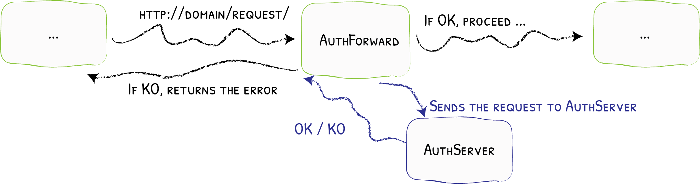

# 7 - Authentication

To add authentication to services proxied through Traefik, middlewares can be used. Specifically, we will be using the [Forward-Auth](https://doc.traefik.io/traefik/v2.2/middlewares/forwardauth/) middleware:



Incoming requests will be forwarded to middlewares before hitting the actual service. The middleware is configured with an address that is queried to authenticate the user. This address should point to the authentication service. We will be using [Authelia](https://www.authelia.com/), as it is lightweight and requires only minimal configuration. Other providers, such as [Authentik](https://goauthentik.io/), can also be used.

# Authelia Setup

First, we set up the Authelia service. Copy all files from `containers/authelia/` to your host. The compose file for Authelia should feel familiar, as it is structured very similar to the other services.

The Authelia configuration files require some work. Authelia has to know which domain to protect. Hence, you need to update the configuration file to match your domain/subdomain. Next, generate some secrets with the commands in the comments.

To manage users, Authelia supports multiple providers. We use the file backend, as it is the easiest and lowest-overhead mechanism. Update the sample user in the file and generate a hashed password.

Start the Authelia compose stack and head to `https://auth.$MY_DOMAIN`. You should see a login screen, and you should be able to log in.

With Authelia running, we define a new middleware for Traefik in its `config.yml` file:

```diff
 http:
   middlewares:
+    authelia:
+      forwardAuth:
+        address: "http://authelia:9091/api/verify?rd=https://auth.$MY_DOMAIN"
+        authResponseHeaders: Remote-User,Remote-Groups,Remote-Name,Remote-Email
+        trustForwardHeader: true
```

The interesting part here is the URL for the `address` field. Since both Authelia and Traefik are part of the proxy network, Traefik can communicate with the Authelia container directly via its DNS name, `authelia`. When Traefik receives a request for an endpoint that requires authentication, Traefik will forward the request to Authelia to verify if the user is authenticated. Authelia verifies the user is authenticated by inspecting the `authelia_session` cookie. If the user is not authenticated, Authelia redirects the Browser to the redirect URL `https://auth.$MY_DOMAIN`, which is the Authelia instance itself, but reachable for the Client's Browser through Traefik. There, the Client can authenticate and obtain a session cookie for subsequent requests. 

Next, we define a Middleware chain. The chain works through all listed middlewares sequentially. This step is optional, but increases the readability:

```diff
 http:
   middlewares:
+    secured-internal:
+      chain:
+        middlewares:
+        - authelia
+        - default-headers
```

Restart Traefik to apply the changes and reload the config files. 

With the middlewares in place, we can modify our services to include authentication by adding the middleware. We can either specify the middleware chain (shown below) or all individual middlewares as a comma-separated list: `authelia@file, default-headers@file`.

```diff
 services:
   drawio:
     [...]
     labels:
       - "traefik.enable=true"
       
       - "traefik.http.routers.draw-io.entrypoints=https"
       - "traefik.http.routers.draw-io.rule=Host(`draw.$MY_DOMAIN`)"
       - "traefik.http.routers.draw-io.priority=1000"
       - "traefik.http.routers.draw-io.tls=true"
       - "traefik.http.routers.draw-io.service=drawio"
+      - "traefik.http.routers.draw-io.middlewares=secured-internal@file"
-      - "traefik.http.routers.draw-io.middlewares=default-headers@file"
       - "traefik.http.services.drawio.loadbalancer.server.port=8080"

       - "traefik.docker.network=proxy"
```

That's it! Restart the Draw.io stack to apply the changed labels. Traefik should automatically pick up the changes and insert the middlewares. 

**Tip**: Since Authelia verifies the session cookie, use a private browser window when debugging authentication.

## Using an External Authelia Instance

Suppose you want to use an external Authelia instance, for example, because you have two hosts: one Auth server with Traefik and Authelia, and a downstream server with Traefik and proxied services. In that case, you have to make two changes:

- The `address` property of the middleware has to be adjusted on the downstream server
- The Traefik entrypoints of the Auth server have to trust the IP of the downstream host

You previously learned that the first part of the `address` property of the middleware is what Traefik calls to communicate with Authelia. The redirect URL is where the browser is redirected to authenticate. Hence, we have to update the first part on the downstream server:

```diff
 http:
   middlewares:
    authelia:
      forwardAuth:
+        address: "http://auth.$MY_DOMAIN/api/verify?rd=https://auth.$MY_DOMAIN"
-        address: "http://authelia:9091/api/verify?rd=https://auth.$MY_DOMAIN"
        authResponseHeaders: Remote-User,Remote-Groups,Remote-Name,Remote-Email
        trustForwardHeader: true
```

Note: **Do not** change the URL like this on the Auth server itself where Authelia is running, as this will lead to an internal loop and an internal server error with Traefik.

Next, we have to modify the `https` entrypoint on the Auth server to trust the IP of the downstream server; otherwise, Traefik will strip the headers (e.g., `X-Forwarded-*`) from the request that the downstream Traefik instance requires to complete the login flow:

```diff
 entryPoints:
   http:
     address: ":80"
     http:
       redirections:
         entryPoint:
           to: https
           scheme: https
   https:
     address: ":443"
+    forwardedHeaders:
+      trustedIPs:
+        - "192.168.178.10" # has to match the IP or subnet of the downstream host
```